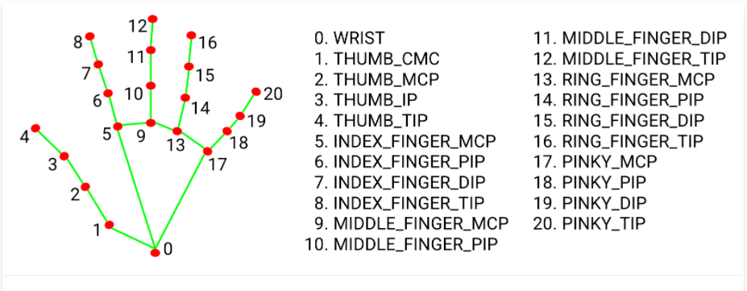

# Virtual-Pen-CV #
The project enables you to write virtually with your fingers. MediaPipe and OpenCV libraries are used.  

## MediaPipe ##
MediaPipe is a framework for building multimodal (eg. video, audio, any time series data), cross platform (i.e Android, iOS, web, edge devices) applied ML pipelines. With MediaPipe, a perception pipeline can be built as a graph of modular components, including, for instance, inference models (e.g., TensorFlow, TFLite) and media processing functions. It provide many pretrained modules like face detection, hand tracking, hair segmentation, object detection, etc.

[click here](https://www.mediapipe.dev) for more information.

### MediaPipe Hands ###
MediaPipe Hands is a high-fidelity hand and finger tracking solution. It employs machine learning (ML) to infer 21 3D landmarks of a hand from just a single frame. It utilizes an ML pipeline consisting of multiple models working together: A palm detection model that operates on the full image and returns an oriented hand bounding box. A hand landmark model that operates on the cropped image region defined by the palm detector and returns high-fidelity 3D hand keypoints.

#### Hand Landmark Model ####
Hand landmark model performs precise keypoint localization of 21 3D hand-knuckle coordinates inside the detected hand regions via regression, that is direct coordinate prediction. The model learns a consistent internal hand pose representation and is robust even to partially visible hands and self-occlusions. The model is trained with 30k real-world images with 21 3D coordinates. It also render a high-quality synthetic hand model over various backgrounds and map it to the corresponding 3D coordinates.

### MediaPipe Installation ###
[click here](https://google.github.io/mediapipe/getting_started/install.html) to know about installation.

## OpenCV ##
OpenCV is a huge open-source library for the computer vision, machine learning, and image processing and now it plays a major role in real-time operation which is very important in today's systems. python-opencv is used in this project.

[click here](https://pypi.org/project/opencv-python) to know about installation and more.
